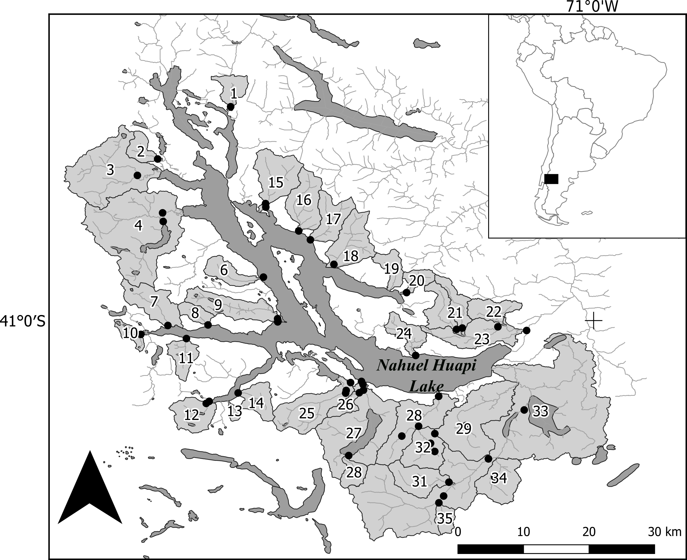
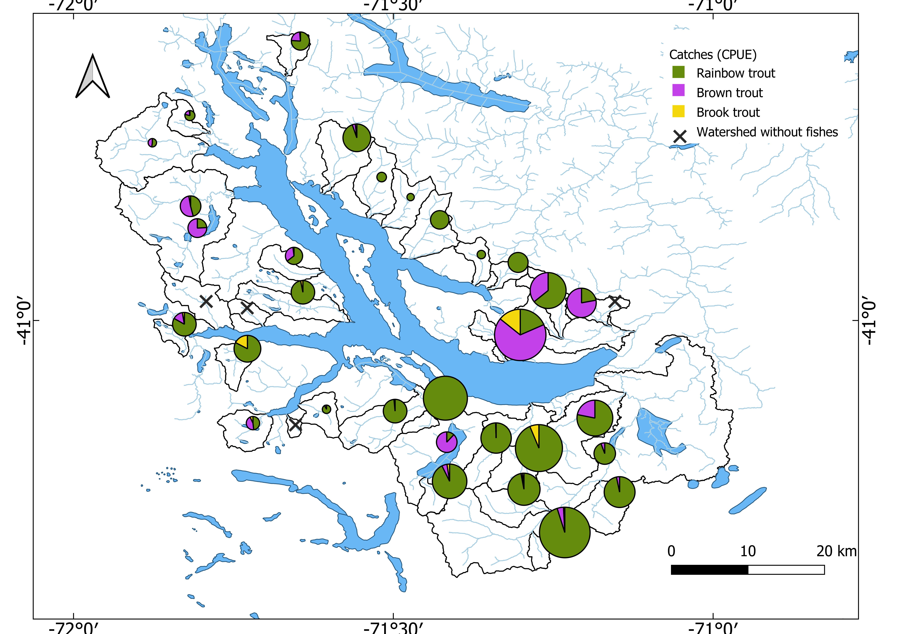

```{r setup, include=FALSE}
knitr::opts_chunk$set(echo = TRUE)
```

```{r libraries, include=FALSE}
#Load libraries
library(tidyverse) # The tidyverse set of packages
library(gt) # A layered 'grammar of tables' - think ggplot, but for tables
library(VennDiagram)
library("Hmisc")
library(factoextra)
```

## Abstract

Ecological communities are structured by a combination of factors known as habitat templates. These templates work as a ´filter’ that permits some species with particular traits or phenotypes to establish and persist while excluding others. Defining which habitat variables and spatial scales have the stronger influence on freshwater communities is key to effective and efficient management of fluvial ecosystems. We took advantage of the relatively recent and well-studied history of salmonid introductions to Patagonia to evaluate if patterns of association of non-native species with abiotic factors vary between different spatial scales of the environmental filter. We characterized environmental variables at the basin and reach scale to assess their influence on the presence, abundance and structure of the salmonid assemblages in breeding streams. We found no evidence supporting that presence/absence patterns of salmonid distribution were strongly driven by landscape variables, except for basins with physical barriers to migration. However, we did find support for some climatic and geomorphological variables (e.g., precipitation and relief) influencing relative abundances. Our results do not support a scenario in which the distribution of any of the species affects the distribution of the other species, and suggest interference has played only a minor role in determining current fish distribution in the region. Instead, current patterns of presence and abundance of salmonids are best explained as the product of environmental filters. Our findings contribute to our understanding of the ecology of individual species and provide insight into mechanisms structuring fish assemblages in Southern Hemisphere’s lotic systems.

## Introduction

Ecological communities are structured by combinations of factors defined as habitat templates (Southwood, 1977). These habitat templates mold evolutionary forces and structure ecological strategies for each of the species within the community. In other words, both the presence of a species at a particular site and its life history strategy are the result of environmental filtering (i.e., the tolerance of the species to a particular subset of biotic and abiotic characteristics) and trade-offs met during habitat adaptation.

Fluvial ecosystems are characterized by a physical habitat strongly influenced by the inherent hierarchical structure and patchiness that determine the distribution of organisms, food availability, predation and competition (Frissell et al., 1986, Schlosser & Kallemeyn, 2000). Fine-scaled variability results from the interaction between large-scale landscape variables (e.g., basin area, slope profile of stream-associated valleys and other geomorphological traits) and smaller scale variables (e.g., local structure and condition) (Frissell et al. 1986; Schlosser & Kallemeyn 2000). Because of that, defining which habitat variables and spatial scales have the most influence on freshwater communities is key to effective and efficient management of fluvial ecosystems (Matthews, 1998, Gido et al., 2006). 

Environmental filtering is considered a major structuring mechanism of communities (Weiher & Keddy 1995). It is dominated by three ecological factors: dispersal restriction, abiotic environment and biotic interactions (Belyea & Lancaster, 1999). The first two act on a regional scale and delimit the area of action of the third, which operates on a local scale (Booth & Swanton, 2006). While the utility of the environmental filtering concept has been argued on the basis that it predicts patterns that cannot be distinguished from those produced by other mechanisms, such as competition (Kraft et al., 2015), there are good reasons to explore how patterns of trait or phylogenetic dispersion change in response to the environment (Cadotte & Tucker, 2017) .Therefore, if the relative effects of these general classes of factors in streams could be disentangled, then we would gain a comprehensive view of how each factor drives community composition.

In Patagonia, particularly at the scale of large drainage basins, fish distribution has been strongly influenced by the Andean uplift and the Quaternary glacial cycles (Hubert & Renno, 2006). After the retreat of glaciers during the Pleistocene, the ability of Patagonian fish to colonize post-glacial water bodies determined their present distribution, clearly constrained by climate, especially by temperature (Cussac et al., 2004, Ruzzante et al., 2006). In recent times, native freshwater fish communities have been altered on repeated occasions by the introduction of non-native species to generate sport fisheries, resulting in communities where up to six native species and four introduced salmonid species coexist within the watershed (Macchi et al., 1999). Many of these species have stable populations at several large lakes that have been intensively studied (Cussac et al., 2014). In contrast, relatively little is known about fish assemblages in streams or about the environmental filters that structure riverine communities (Aigo et al., 2008, Pascual et al., 2002, 2007, Barriga et al.2013, Lallement et al. 2020). 

Of the four species introduced since 1904, rainbow trout (*Onchorhynchus mykiss*, Walbaum 1792), brown trout (*Salmo trutta*, Linnaeus 1758) and brook trout (*Salvelinus fontinalis*, Mitchill 1814) are currently the most widely distributed and abundant species. The rapid adaptation of these salmonid species to the new environment enabled them to establish self-sustaining populations, obviating the need for continuous import of eggs and ensuring of a steady supply of fish from local reproducers. The short and well-known history of introductions in the region shows that these species have high dispersive capabilities and found practically no biological resistance to invasion (Pascual et al. 2007). Thus, it can be posited that their current distribution in Patagonia is the result of environmental filtering at different scales. Although the influence of the landscape scale factors has been evaluated for the two most abundant species of salmonids in previous works (Quirós, 1991, Aigo, et al., 2008; Lallement et al. 2020), it is not known whether these factors alone explain the richness of non-native species in the watershed.

The objective of this work was to examine watershed and reach-level patterns of introduced salmonid species in North Patagonian rivers and their association with watershed characteristics derived from remote sensing and topography data across an environmental gradient. We compared the relative variation in salmonid density across different kind of watersheds expecting that some environmental characteristics at a landscape and reach scale conditioned i) the presence of salmonids, ii) the abundance of each species, iii) the assemblage conformation and iv) the dominance of a species at a regional level. We characterized environmental variables at the basin and reach scale to assess their influence on the presence, abundance and structure of the salmonid assemblages in breeding streams of the Upper Limay river basin. Our findings contribute to our understanding of the ecology of individual species and provide insight into mechanisms structuring fish assemblages in Southern Hemisphere’s stream systems. Such information not only contributes to knowledge of the ecological processes structuring aquatic communities, but also helps direct conservation and management activities.

## Methods

### Study Area

The Upper Limay River basin is located between the provinces of Río Negro and Neuquén (~40°63’ S, 71° 70’ W), Argentina, and drains an area of 6.980 km2, most of it within the boundaries of Nahuel Huapi National Park (Figure 1). Originating in the eastern slopes of the Andes mountain range, the basin presents a complex hydrological network, with many streams, rivers and lentic water bodies. Due to rain-shadowing effects by the Andes, the area experiences a steep longitudinal climatic gradient going from 3000 mm of yearly precipitation in the West to less than 600 mm to the East in about 60 km (Paruelo et al., 1998). This climatic gradient results in an eastward transition from a cold-temperate rainforest to shrubby dry steppes. The watershed has a highly connected, complex hydrologic network characterized by deep oligotrophic lakes of varying size, interconnected by streams, ponds and wetlands. The main hub of the network is Nahuel Huapi Lake, with an area of 529 km2 and a maximum depth of 464 m, which collects most waters from the basin, and drains through the Limay River towards the Atlantic Ocean (Figure 1).  



### Selection of watersheds

Thirty-five basins fully representing the environmental gradient of the watershed were selected for this study (Figure 1). For each basin, one or more sections of 2nd order or higher were selected; selection criteria were size, registered physiographic changes, existence of natural or anthropic barriers and the accessibility to each section (Bain & Stevenson, 1999). Based on these criteria, some basins were represented by a single section, while others had two or more representative sections. On larger basins with enough altitudinal range (e.g., Machete, Gutiérrez, Ñireco, Ñirihauau and Chacabuco), additional sections on tributary streams were sampled.

### Watershed variables

A total of 32 watershed attributes were chosen following the available literature (Angermeier & Winston, 1999, Oakes et al., 2005, Smith & Kraft, 2005), and were grouped into four distinct categories (Geomorphological, Climatological, Land Use and Vegetation) based on the general aspect of the environment measured by each variable (Table A-Appendix section). All categories were calculated using GIS tools (version 2.6) under the QGIS environment (QGIS Development Team, 2014), or using specific formulas following Bain and Stevenson (1999). Land Use and Vegetation data were obtained from existing digital map layers available from the National Geographic Institute, the National Institute of Agricultural Technology (INTA) and National Parks Administration’s Biodiversity Information System; these maps were complemented with satellite imagery from Google Earth. Watershed morphological variables were calculated based on a digital elevation model with a resolution of 30 m (Landsat 6TM+). Average annual precipitation (mm) and temperature were calculated based on a map interpolating averages of daily measures from 25 meteorological stations located within from 38°46’0S–41°30’0S and 70°03’0W–71°45’0W (Barros et al., 1983). The Normalized Differential Vegetation Index (NDVI) was calculated from Landsat 6TM+ satellite images during the summer season of 2014. Geoprocessing and zonal statistics were computed using Quantum Gis (QGIS) (version 2.6) and digital map data. All the variables are available in the Appendix section (Table A).


```{r}
#TABLE 1 - Basin-level variables
basins <- read_csv("basins.csv")
gt(basins)
```

### Local Variables

Physicochemical variables were collected in 42 reaches. Variables included geomorphological, substrate type, hydrological and water quality (Table B-Appendix section). Location and number of sections sampled by stream were determined by the pattern shape of channels, covered area and accessibility, which determined that streams with the largest area have a greater number of sections sampled. Thus, sections were selected based on particular characteristics of each stream such as changes in the relief or riverine vegetation, tributary unions and presence of ponds or waterfalls.


```{r}
#TABLE 2 - Reach-level variables
reach <- read_tsv("reaches.tsv")
gt(reach)
```

### Fish Capture

Different stream segments that presented a succession of pool-riffle-pool habitats were sampled during the austral summer (from December to March) of 2013-2014. The minimum sampled area depended on the size of the selected reach. In each section, presence-absence data were collected by three-pass electrofishing with a Smith-Root mod 12B equipment along 50-m reach. Relative abundance, expressed as catch per unit effort (CPUEN), was standardized based on actual length of each sweep to number of fish caught per 100 m2. Electrofishing was conducted from downstream to upstream following a zigzag trajectory and exploring all habitat types. The extremes were not blocked with nets. For basins sampled in more than one section, an average of the CPUEN of all fished sections was used as basin-level fish abundance. The Administration of Nahuel Huapi National Park and San Carlos de Bariloche Town Council approved our protocols and procedures and granted permission to collect fish samples (APN project n° 1173 and S.C de Bariloche Council note n° 412/SSMA/15).

## Results

### Introduced salmonid species are unevenly distributed among basins
Only two specimens of native species were caught: one of *Galaxias maculatus* (Jennyns, 1842) in the Frey basin and another of *Hatcheria macraei* (Girard, 1885) in the Ñirihuau basin. In contrast, a total of 4531 salmonids were caught. We found individuals aged between 0 and 3 years old at all sites, but older specimens (up to 8 years old) were caught only in some of the Eastern basins. No fish were captured in the Newbery, Blanco, Bravo and Uhueco basins; these streams present physical barriers (large waterfalls) restricting upstream movement of fish from the rest of the system (Figure 2). 


*Oncorhynchus mykiss* was present in all basins where fish were caught. This species was also the most abundant in almost all basins (31/35); *Salmo trutta*, though present in 21/35 basins, was dominant in only 4 of them (Figure 2). *Salvelinus fontinalis*, was captured in 15/35 basins, but never dominated the assemblage (Figure 2). 

Co-occurrence of introduced salmonid species varied among basins. The three species were found together in 10 basins. Only two out of three possible bispecific assemblages were found: rainbow trout with brown trout (*S.trutta* +*O. mykiss*, n = 10) and brown trout with brook trout (*S.fontinalis* + *O.mykiss*, n = 4). Monospecific assemblages were found only for rainbow trout (*O. mykiss*, n = 7). 

### No interspecific reciprocal influences on presence are evidenced by salmonid species distribution
Independence of species presence was tested using a contingency table approach, asking whether the probability of a species being present was contingent on the presence of other species.We calculated the expected frequency of each combination of species under the assumption that species distributions are independent of each other, based on the frequency each species was found. We then calculated the expected counts of all combinations, and compared them to the observed counts using a Fisher´s exact Test for contingency tables.

```{r}
####Contingency test on joint species presence####

#Field data: number of basins in which a given species is present
Ntotal <- 35 #Total basins
NOm <- 31 #Basins in which rainbow trout Onchorhynchus mykiss (Om) is present
NSf <- 15 #Basins in which brook trout Salvelinus fontinalis (Sf) is present
NSt <- 21 #Basins in which brown trout Salmo trutta (St) is present

#Counts of basins in which each combination of species occur
NOb <- c(4,7,0,0,4,10,0,10)
names(NOb)<-c("none","Om","Sf","St","Om.Sf","Om.St","St.Sf","Om.Sf.St")

#Marginal probabilities
pOm <- NOm/Ntotal
pSf <- NSf/Ntotal
pSt <- NSt/Ntotal

#Calculate expected frequencies as joint probabilities
cOm <- pOm - pOm*pSf*pSt -(pOm*pSf - pOm*pSf*pSt) -(pOm*pSt - pOm*pSf*pSt)
cSf <- pSf - pOm*pSf*pSt -(pOm*pSf - pOm*pSf*pSt) -(pSt*pSf - pOm*pSf*pSt)
cSt <- pSt - pOm*pSf*pSt -(pOm*pSt - pOm*pSf*pSt) -(pSt*pSf - pOm*pSf*pSt)
cOm.Sf <- pOm*pSf - pOm*pSf*pSt
cOm.St <- pOm*pSt - pOm*pSf*pSt
cSt.Sf <- pSt*pSf - pOm*pSf*pSt
cOm.Sf.St <- pOm*pSf*pSt
none <- 1-sum(cOm,cSf,cSt,cOm.Sf,cOm.St,cSt.Sf,cOm.Sf.St)

#Build a vector of expected frequencies
frExp <- c(none,cOm,cSf,cSt,cOm.Sf,cOm.St,cSt.Sf,cOm.Sf.St)
names(frExp)<-c("none","Om","Sf","St","Om.Sf","Om.St","St.Sf","Om.Sf.St")

#Plot a Venn diagram
col.scheme <- c("red","green","blue")
draw.triple.venn(pOm,pSt,pSf,pOm*pSt,pSt*pSf,pSf*pOm,pOm*pSt*pSf, c("Om","St","Sf"), fill=col.scheme, cat.col=col.scheme, print.mode="percent")

#Calculate vector of expected frequencies
NExp <- frExp*Ntotal

#Build a table of expected and observed occurrences.
expvsobs <- cbind(round(NExp),NOb)
colnames(expvsobs)<-c("Expected","Observed")
expvsobs <- as_tibble(expvsobs, rownames = "Species")
gt(expvsobs)

#Performs Fisher's exact test for testing the null of independence of rows and columns in a contingency table with fixed marginals
ftest_all_basins <- fisher.test(expvsobs %>% select(Expected, Observed))
ftest_all_basins


## Now repeat all of the above, but dropping those basins where no fish was caught.
## This explores that those basins are categorically different due to insurmountable obstacles for dispersal.
#Field data: number of basins in which a given species is present
Ntotal <- 31
NOm <- 31
NSf <- 15
NSt <- 21

#Counts of basins in which each combination of species occur
NOb <- c(7,0,0,4,10,0,10)
names(NOb)<-c("Om","Sf","St","Om.Sf","Om.St","St.Sf","Om.Sf.St")

#Marginal probabilities
pOm <- NOm/Ntotal
pSf <- NSf/Ntotal
pSt <- NSt/Ntotal

#Calculate expected frequencies as joint probabilities
cOm <- pOm - pOm*pSf*pSt -(pOm*pSf - pOm*pSf*pSt) -(pOm*pSt - pOm*pSf*pSt)
cSf <- pSf - pOm*pSf*pSt -(pOm*pSf - pOm*pSf*pSt) -(pSt*pSf - pOm*pSf*pSt)
cSt <- pSt - pOm*pSf*pSt -(pOm*pSt - pOm*pSf*pSt) -(pSt*pSf - pOm*pSf*pSt)
cOm.Sf <- pOm*pSf - pOm*pSf*pSt
cOm.St <- pOm*pSt - pOm*pSf*pSt
cSt.Sf <- pSt*pSf - pOm*pSf*pSt
cOm.Sf.St <- pOm*pSf*pSt
none <- 1-sum(cOm,cSf,cSt,cOm.Sf,cOm.St,cSt.Sf,cOm.Sf.St)

#Build a vector of expected frequencies
frExp <- c(cOm,cSf,cSt,cOm.Sf,cOm.St,cSt.Sf,cOm.Sf.St)
names(frExp)<-c("Om","Sf","St","Om.Sf","Om.St","St.Sf","Om.Sf.St")

#Plot a Venn diagram
col.scheme <- c("red","green","blue")
#draw.triple.venn(pOm,pSt,pSf,pOm*pSt,pSt*pSf,pSf*pOm,pOm*pSt*pSf, c("Om","St","Sf"), fill=col.scheme, cat.col=col.scheme, print.mode="percent")

#Calculate vector of expected frequencies
NExp <- frExp*Ntotal

#Build a table of expected and observed occurrences.

expvsobs.2 <- cbind(round(NExp),NOb) 
colnames(expvsobs.2)<-c("Expected","Observed")
expvsobs.2 <- as_tibble(expvsobs.2, rownames = "Species")
gt(expvsobs.2)

#Performs Fisher's exact test for testing the null of independence of rows and columns in a contingency table with fixed marginals
ftest_no_empty_basins <- fisher.test(expvsobs.2 %>% select(Expected, Observed))
ftest_no_empty_basins
```

Fisher's exact test failed to reject the hypothesis of independence (*p* = `r ftest_all_basins$p.value`),
suggesting that species interactions are not needed to explain the frequency of each combination. Expected and observed counts are even more similar when basins without fish captures are excluded from the calculations (*p* = `r ftest_no_empty_basins$p.value`).


### Salmonid abundances varied with environmental variables.

We then used generalized linear models (GLMs) on presence/absence and relative abundance data to assess the filtering influence of landscape and local variables. For each level and response variable type, we tried two approaches: 1) reducing the dimensionality of the independent variables through a principal components analysis (PCA), and then using the principal components explaining most variance as predictor variables in the GLM; and 2) by selecting independent variables that were not significantly correlated and using them as predictor variables in the GLM. While these two approaches are expected to yield qualitatively similar results, the second approach lends to more straightforward interpretations. All analyses were run using the function `glm` from the `base` package of the R computing environment R Core Team, version 3.5.1 (2018). To regress environmental variables using presence/absence as a response variable, we used a binomial logistic regression with a logit link. When the response variable was the logarithm of relative abundance, we used a Gaussian regression with an identity link.


```{r}
#### Basin-level correlation analysis ####
basin.cpue.cor <- cor(basins[,-1], use="pairwise.complete.obs", method="spearman")[,18:21]
basin.cpue.cor.test <- rcorr(as.matrix(basins[,-1]), type="spearman") 
basin.cpue.cor.test$r[,29:32] %>%
  as_tibble(rownames = "variable")
```

Total catch of salmonids in streams from the upper Limay basin increased along a NW-SE gradient (Table 2). This gradient in relative abundance was associated to basins having a larger proportion of lowland, shrubby environments characterized by low rainfall, open woodlands and fewer rocky outcrops. This pattern in total catch was likely driven by dominance of rainbow trout, since its relative abundances presented the same pattern as the total catch (with the addition that abundance was higher at lower basins). 

In contrast, brown trout abundances were not clearly associated with geographic gradients (Table 2). Instead, higher abundances were associated with lower, warmer and flatter basins, with fewer High-Andean habitat and more wetlands. Brook trout abundance showed no significant correlations with any environmental variable. However, spotty occurrence and low overall abundance of this species resulted in very low statistical power to detect any existing correlations.

### Patterns of salmonid distribution are not strongly driven by landscape variables

Having ruled out a role for the interaction between species in their joint distribution (see above), we evaluated the influence of basin characteristics on individual species presence and abundances. We derived 28 watershed variables from remote sensing and topographical data sources. 

```{r}
#### Basin-level PCA and GLM analysis ####
basin.pca <- prcomp(basins[,2:29],center = TRUE, scale. = TRUE)
summary_basin.pca <- summary(basin.pca)
biplot(basin.pca)

basins$p.TAI <- ifelse(basins$TAI==0,0,1)
basins$p.TAR <- ifelse(basins$TAR==0,0,1)
basins$p.TAM <- ifelse(basins$TAM==0,0,1)

fviz_pca_ind(basin.pca, geom.ind = "point", 
             col.ind = "#FC4E07", 
             axes = c(1, 2), 
             pointsize = 1.5) 

fviz_screeplot(basin.pca, choice="eigenvalue")


basins <- cbind(basins, basin.pca$x[,1:3])

total.glm<-glm(Total~PC1+PC2+PC3, data=basins)
summary(total.glm)

p.tai.glm<-glm(p.TAI~PC1+PC2+PC3, data=basins, family="binomial")
summary(p.tai.glm)

tai.glm<-glm(TAI~PC1+PC2+PC3, data=basins)
summary(tai.glm)
tai.glm<-glm(TAI~PC1+PC2+PC3, data=basins)
summary(tai.glm)
log.tai.glm<-glm(log(TAI+0.00001)~PC1+PC2+PC3, data=basins)
summary(log.tai.glm)


p.tam.glm<-glm(p.TAM~PC1+PC2+PC3, data=basins, family="binomial")
summary(p.tam.glm)
tam.glm<-glm(TAM~PC1+PC2+PC3, data=basins)
summary(tam.glm)
log.tam.glm<-glm(log(TAM+0.00001)~PC1+PC2+PC3, data=basins)
summary(log.tam.glm)

p.tar.glm<-glm(p.TAR~PC1+PC2+PC3, data=basins, family="binomial")
summary(p.tar.glm)
tar.glm<-glm(TAR~PC1+PC2+PC3, data=basins)
summary(tar.glm)
log.tar.glm<-glm(log(TAR+0.00001)~PC1+PC2+PC3, data=basins)
summary(log.tar.glm)

```


We found that many of the variables were highly correlated; thus, we used a principal component analysis (PCA) to reduce the dimensionality of variable space. The first three principal components (PC) explained `r  summary_basin.pca$importance[3,3]*100` % of the total variance (PC1 `r  summary_basin.pca$importance[2,1]*100`%; PC2 `r  summary_basin.pca$importance[2,2]*100`%, PC3 `r  summary_basin.pca$importance[2,3]*100`%).

We used these three PCs to test if basin characteristics influenced the presence of each species by fitting a logistic regression using GLMs (see Methods), but found no significant influence of either PC on presence for any of the species. We then repeated the same analysis using relative abundance (individuals caught per unit effort; CPUEN) as a dependent variable instead. We found that rainbow trout abundance was significantly influenced by PC3 (p=0.001, loaded mainly by Latitude and Zmin), while brown trout abundance was instead, significantly influenced by PC1 (p=0.002, loaded mainly by Steppe and precipitations). Brook trout was not influenced by any PCs (Table 3). Repeating the analyses using the logarithm of relative abundance as response variable yielded no significant results for any species or PCs.

Hence, for all three species, we found that the probability of a species being present in a basin was not explained by any of the basin characteristics we used in this analysis. However, we detected evidence that the abundance of rainbow trout and brown trout (but not brook trout) is influenced by different combinations of basin traits. Thus, the three species differ in their response to landscape level filtering variables.

### Local variables influence weakly but differentially the abundance of each species

To evaluate the influence of local characteristics on species presence we estimated 31 variables using local data records (see Table 3). Since several local-scale variables presented significant correlations, we used PCA to reduce the dimensionality of the variable space. 

```{r}
#### Reach-level PCA and GLM analysis ####
reach<-read.table("reaches.tsv", header=TRUE, sep="\t")
reach$p.TAI <- ifelse(reach$TAI==0,0,1)
reach$p.TAR <- ifelse(reach$TAR==0,0,1)
reach$p.TAM <- ifelse(reach$TAM==0,0,1)

reach.pca <- prcomp(na.omit(reach[,2:32]),center = TRUE, scale. = TRUE)
summary_reach.pca <- summary(reach.pca)
biplot(reach.pca)

fviz_pca_ind(reach.pca, geom.ind = "point", 
             col.ind = "#FC4E07", 
             axes = c(1, 2), 
             pointsize = 1.5) 

fviz_screeplot(reach.pca, choice="eigenvalue")
fviz_screeplot(reach.pca, choice="variance")
fviz_contrib(reach.pca, choice="var", axes=3)

reach <- cbind(reach, reach.pca$x[,1:3]) 

r.total.glm<-glm(Total~PC1+PC2+PC3, data=reach)
summary(r.total.glm)

r.p.tai.glm<-glm(p.TAI~PC1+PC2+PC3, data=reach, family="binomial")
summary(r.p.tai.glm)

r.tai.glm<-glm(TAI~PC1+PC2+PC3, data=reach)
summary(r.tai.glm)

r.log.tai.glm<-glm(log(TAI+0.00001)~PC1+PC2+PC3, data=reach)
summary(r.log.tai.glm)


r.p.tam.glm<-glm(p.TAM~PC1+PC2+PC3, data=reach, family="binomial")
summary(r.p.tam.glm)

r.tam.glm<-glm(TAM~PC1+PC2+PC3, data=reach)
summary(r.tam.glm)

r.log.tam.glm<-glm(log(TAM+0.00001)~PC1+PC2+PC3, data=reach)
summary(r.log.tam.glm)

r.p.tar.glm<-glm(p.TAR~PC1+PC2+PC3, data=reach, family="binomial")
summary(r.p.tar.glm)

r.tar.glm<-glm(TAR~PC1+PC2+PC3, data=reach)
summary(r.tar.glm)

r.log.tar.glm<-glm(log(TAR+0.00001)~PC1+PC2+PC3, data=reach)
summary(r.log.tar.glm)
```


The first three principal components (PC) explained `r  summary_reach.pca$importance[3,3]*100` % of the total variance (PC1 `r  summary_reach.pca$importance[2,1]*100` %; PC2 `r  summary_reach.pca$importance[2,2]*100`%, PC3 `r  summary_reach.pca$importance[2,3]*100`%).

We tested whether local characteristics influenced the presence-absence of each species by fitting a logistic regression using Generalized Linear Models, and found no significant influence of either PCs on presence-absence for rainbow trout and brown trout, while PC2 (loaded mainly by water quality and slope variables) had a significant influence on presence of brook trout (z-value=-2.62, p-value=0.009). We then tested if reach variables influence relative abundances (either absolute values or their logarithms) and found a significant relation between PC1 (loaded mainly by channel morphology and water quality variables) and rainbow trout abundances (absolute – t=3.86, p=0.0004 and logarithms values –t=2.94, p=0.0055), but no significant influence on brown trout. We found significant influence of PC2 on the logarithm of brook trout abundance (t-value=-2.97, p=0.0052) but not on the absolute values. In summary, our regression analysis showed that the influence of local traits varies across all three salmonid species.

## Discussion

One of the most pervasive concepts in the study of community assembly is the metaphor of the environmental filter, which refers to abiotic factors that prevent the establishment or persistence of species in a particular location. However, this concept has been criticized because the evidence used in many studies to assess environmental filtering is insufficient to distinguish filtering from the evolutionary outcome of historical biotic interactions (Kraft et al. 2015). In our work we took advantage of the relatively recent and well-studied history of salmonid introductions to evaluate if non-native species show different patterns of association with abiotic factors at different spatial scales of the filter.

Successful establishment of introduced salmonid species can depend on both biotic resistance (by the native community of organisms) and environmental resistance (habitat suitability), as well as chance events (Moyle & Light, 1996, Karr et al.,1987, Fausch,2007). The success of its dispersion has been well studied in several environments such as New Zealand (McDowall, 2003), Europe (Korsu, Huusko & Muotka, 2008) and Chile (Arismendi et al., 2014, 2019 , Habit, 2015). When salmonids were introduced to Patagonian waters in 1904 (Baigún & Quirós, 1985), they found almost no biotic resistance for the invasion and achieved a wide distribution throughout the region (Pascual et al. 2007). We indeed found widespread presence of salmonid species and almost total absence of native species in our study area. Thus, the only expected source of current biotic interference would be interspecific interaction between the salmonid species themselves. However, the results of our contingence analysis on species distribution does not support a scenario in which any of the species is affecting the distribution of the other species. This suggests that the streams in our study area have not reached carrying capacity for salmonids. Alternatively, salmonid species might be partitioning the riverine habitats to minimize niche overlap, as reported in other parts of the world (Bozek & Hubert, 1992, Reeves, Bisson & Dambacher, 1998, Fausch, 2008, Marchetti et al., 2011).

Interspecific interference among salmonid species has been proposed in previous studies in this region (Juncos, Beauchamp & Vigliano, 2013, Arismendi et al., 2014); we found however no evidence for it. Thus, we can assume that interference has played only a minor role in determining current fish distribution in the region. Instead, current patterns of presence and abundance of salmonids are best explained as the product of environmental filters. Indeed, reasons for the successful invasion reported from southern Chile has been related in part to the excellent abiotic conditions they found in the region (Pascual et al., 2005, Habit et al., 2012, Habit et al., 2015).

Biological invasions are inherently complex. A successful invader must survive a series of events: transport to the invasion site, initial establishment, spread to a broad area, and then integration into the existing biotic community (Moyle & Light, 1996, Kolar & Lodge, 2001). Not surprisingly, most introduced species fail to become established and reach invasive status (Moyle and Light 1996, Arismendi et al., 2014). Our results suggest that in North Patagonia, biotic resistance from native fish species seems to have had little or no influence on the invasion process by introduced salmonid species, and that success of invaders in the face of low odds is related, as we previously suggested, mostly with the presence of favorable environments, such as flow regime (conditioned for the rainfall gradient) and food availability (Lallement et al. 2020).

In contrast to other reports (Marchetti, Moyle & Levine, 2004, Stanfield, Scott & Borwick, 2006), we saw no evidence that presence/absence patterns of salmonid distribution were strongly driven by landscape variables, except for those basins with environmental barriers. However, when analyzing responses of relative abundances (CPUEN), the influence of climatic and geomorphological variables (e.g., precipitation and relief) became more evident. These two types of factors have been mentioned in other systems as determinants of salmonid distribution (Stanfield et al., 2006, Warren, Dunbar & Smith, 2015): rainfall and geology have a direct influence on stream discharge and are thus determinant during early development of salmonid life cycles (Heggenes & Traaen, 1988,Nehring & Anderson, 1993).

Landscape characteristics (e.g., general slope of the valley and geomorphological aspects) determine local river section traits such as substrate composition, pool dimensions and refuge availability, which in turn strongly correlate with the structure and distribution of the assemblages of fish in a basin (Fischer & Paukert, 2008,Rowe, Pierce & Wilton, 2009). For our study area, we found evidence that some local traits modulate rainbow trout abundance but do not explain abundances of brown trout and brook trout, or the presence-absence patterns for all three salmonid species. Low abundances for a species could be causing diminished statistical power to detect the influence of environmental variables; this could be affecting our results for brook trout. Differential abundances are nonetheless likely to result from differential responses to the same environment by each species. Thus, the layered influence of environmental filters was reflected in a weak but differential influence of local traits on abundance of each salmonid species.

Habitat suitability for salmonids is often controlled by local variables as temperature regime (Rahel & Nibbelink, 1999,Harig & Fausch, 2002, Coleman & Fausch, 2007), flow regime (Strange & Foin, 1999, Fausch et al., 2001), stream size (Rahel & Nibbelink, 1999) and habitat factors correlated with stream gradient and channel geomorphology (Fausch, 1989, Montgomery et al., 1999). Due to the steep precipitation gradient in our study area, several streams originate in wooded areas and cross wide valleys where shrubby vegetation typical of arid steppes predominates. Shrubby riverbanks result in higher solar irradiation and air temperatures, favoring higher primary production of the periphyton and sustaining an important biomass of macroinvertebrates (Miserendino, 2007, Modenutti et al., 2010). It is these streams where we found higher fish abundances. 

A hierarchical perspective of stream systems, whereby properties at the site level are constrained by processes occurring in the catchment, provides a useful analytical framework (Vannote et al., 1980, Frissell et al., 1986, Imhol, Fitzgibbon & Annable, 1996). Previous predictive modeling studies have indicated that landscape-scale watershed characteristics are better to explain fish distributions than reach-scale characteristics (Creque, Rutherford & Zorn, 2005, Frimpong et al., 2005). However, this study did not find that watershed-scale variables were significantly better at explaining or predicting fish distributions in North Patagonia. The most likely explanation for this absence of significance can be the lack of habitat saturation by fishes due to temporal variability in fish distributions, unmeasured explanatory (reach- and watershed-scale characteristics) variables in the data set or insufficient sample size. As Stanfield and Gibson (2006), we do not contend that landscape variables are important for salmonids, but suggest that landscape traits condition the range of geomorphological variation inside a watershed that ultimately defines the current densities in a section as we previously observed (Lallement et al. 2020). Results from this study suggest further information is needed to understand how the variability of spatial scale affects the distribution of fishes in streams of Patagonia.

Conservation of stream habitats and their biota requires an understanding of how environmental factors, both natural and human-influenced, structure aquatic assemblages across different scales of space and time (Fausch, Baxter & Murakami, 2010,Grossman, Warnell & Sabo, 2010). Many previous studies have focused on the importance of variables at the local habitat scale or across relatively small study regions. Although not explored in this study, distributions of fishes are variable and may be regulated by seasonal movements and the frequency and duration of stochastic flow cycles. In any case, it is important to bear in mind that the results obtained in regions with different histories of colonization and introduction are not necessarily extrapolated. By including a comprehensive suite of variables at multiple spatial scales in a large region, our study contributes to understanding how these environmental factors may interact to structure invasive fish communities. Moreover, considering the pristine (or near-pristine) condition of the streams sampled here, the relationships observed between fishes and landscape variables can be used as a reference for further studies addressing the effects of human modifications on aquatic biodiversity of North Patagonia.

## Acknowledgments

We thank to the National Park Administration (APN) that through the Biodiversity Information System (SIB) provided us with the data for Use of Land and Vegetation in watersheds. We thank all the members of the Grupo de Evaluación y Manejo de Recursos Icticos (GEMaRI) for their field assistance. Funding was provided by the Agencia Nacional de Promoción de Ciencia y Tecnología, Argentina (PICT projects 016 and 2959). The authors declare no conflict of interest.

## Data Availability Statement

The data and code with the analyses supporting our findings are available at https://github.com/ezattara/patagonian_salmonid_distribution

## References

Aigo J., Cussac V., Peris S., Ortubay S., Gómez S., López H., et al.(2008) Distribution of introduced and native fish in Patagonia (Argentina): patterns and changes in fish assemblages. Reviews in Fish Biology and Fisheries18, 387–408.

Angermeier P.L. & Winston M.R. (1999) Characterizing fish community diversity across virginia landscapes: prerequisite for conservation. Ecological Applications9, 335–349.

Arismendi I., Doris S., Penaluna B., Jara C., Leal C. & León-Muñoz J. (2009) Aquaculture, non-native salmonid invasions and associated declines of native fishes in Northern Patagonian lakes. Freshwater Biology54, 1135–1147.

Arismendi I., Penaluna B.E., Dunham J.B., García de Leaniz C., Soto D., Fleming I.A., et al.(2014) Differential invasion success of salmonids in southern Chile: Patterns and hypotheses. Reviews in Fish Biology and Fisheries24, 919–941.

Arismendi, I., Penaluna, B., Gomez-Uchida, D., Di Prinzio, C., Rodríguez-Olarte, D., Carvajal-Vallejos, F. M., & Savaria, P. (2019). Trout and char of South America. Trout and char of the world, 279-311.

Baigún C. & Quirós R. (1985) Introducción de Peces exóticos en la República Argentina. Mar del Plata.

Bain M.B. & Stevenson N.J. (1999) Aquatic Habitat Assessment:common methods. American Fisheries Society, Bethesda.

Barriga J.P., Espinós N. a., Chiarello-Sosa J.M. & Battini M. a. (2013) The importance of substrate size and interstitial space in the microhabitat selection by the stream-dwelling catfish Hatcheria macraei (Actinopterygii, Trichomycteridae). Hydrobiologia705, 191–206.

Barros V.., Cordon V.., Moyano C.., Mendez R.., Forquera J.. & Pizzio O. (1983) Cartas de precipitación de la zona oeste de las Provincias de Rio Negro y Neuquén: Primera contribución.Buenos Aires.
Belyea L.R. & Lancaster J. (1999) Assembly Rules within a Contingent Ecology. Oikos86, 402.

Booth B.D. & Swanton C.J. (2006) Assembly theory applied to weed communities. Weed Science.

Bozek M.A. & Hubert W.A. (1992) Segregation of resident trout in streams as predicted by three habitat dimensions. Canadian Journal of Zoology70, 886–890.

Cadotte M.W. & Tucker C.M. (2017) Should Environmental Filtering be Abandoned? Trends in Ecology and Evolution32, 429–437.

Coleman M.A. & Fausch K.D. (2007) Cold Summer Temperature Limits Recruitment of Age-0 Cutthroat Trout in High-Elevation Colorado Streams. Transactions of the American Fisheries Society.

Creque S.M., Rutherford E.S. & Zorn T.G. (2005) Use of GIS-Derived Landscape-Scale Habitat Features to Explain Spatial Patterns of Fish Density in Michigan Rivers. North American Journal of Fisheries Management25, 1411–1425.

Cussac V., Becker L., Aigo J., Conte-Grand C., Blasetti G., Cordero P., et al. (2014) Abundance of native fishes, wild-introduced salmonids and escaped farmed rainbow trout in a Patagonian reservoir. Lakes and Reservoirs: Research and Management19, 74–85.

Cussac V.E., Ortubay S., Iglesias G., Milano D., Lattuca E., Barriga J.P., et al. (2004) The distribution of South American galaxiid fishes : the role of biological traits and post-glacial history. Journal of Biogeography, 103–121.

E. Habit, J. González, J. Ortiz-Sandoval, A. Elgueta C.S. (2015) Efectos de la invasión de salmónidos en ríos y lagos de Chile. Ecosistemas24, 43–51.

Fausch K.D. (2008) A paradox of trout invasions in North America. Biological Invasions10, 685–701.

Fausch K.D. (1989) Do gradient and temperature affect distribution of, and interactions between, brook charr (Salvelinus fontinalis) and other resident salmonids in stream? Physiology and Ecology, Japan, 303–322.

Fausch K.D. (2007) Introduction, establishment and effects of non-native salmonids: Considering the risk of rainbow trout invasion in the United Kingdom. Journal of Fish Biology71, 1–32.

Fausch K.D., Baxter C. V. & Murakami M. (2010) Multiple stressors in north temperate streams: Lessons from linked forest-stream ecosystems in northern Japan. Freshwater Biology.

Fausch K.D., Taniguchi Y., Nakano S., Grossman G.D. & Townsend C.R. (2001) Flood disturbance regimes influence rainbow trout invasion success among five holartic regions. Ecological Applications11, 1438–1455.

Fischer J.R. & Paukert C.P. (2008) Habitat relationships with fish assemblages in minimally disturbed Great Plains regions. Ecology of Freshwater Fish17, 597–609.

Frimpong E.A., Sutton T.M., Engel B.A. & Simon T.P. (2005) Spatial-scale effects on relative importance of physical habitat predictors of stream health. Environmental Management.

Frissell C. a, Liss W.J., Warren C.E. & Hurley M.D. (1986) A hierarchical framework for stream habitat classification: viewing streams in a watershead context. Environmental Management10, 199–214.

Gido K.B., Falke J.A., Oakes R.M. & Hase K.. (2006) Fish-habitat relations across spatial scales in prairie streams. American Fisheries Society Symposium48, 265–285.

Grossman G.D., Warnell D.B. & Sabo J.L. (2010) Incorporating Environmental Variation into Models of Community Stability: Examples from Stream Fish.

Habit E., Gonzalez J., Ruzzante D.E. & Walde S.J. (2012) Native and introduced fish species richness in Chilean Patagonian lakes: Inferences on invasion mechanisms using salmonid-free lakes. Diversity and Distributions18, 1153–1165.

E Habit, J González, J Ortiz-Sandoval, A Elgueta, C Sobenes.2015. Efectos de la invasión de salmónidos en ríos y lagos de Chile. Ecosistemas 24 (1), 43-51

Harig A.L. & Fausch K.D. (2002) Minimum habitat requirements for establishing translocated cutthroat trout populations. Ecological Applications.

Heggenes J. & Traaen T. (1988) Downstream migration and critical water velocities in stream channels for fry of four salmonid species. Journal of Fish Biology32, 717–727.

Hubert N. & Renno J.-F. (2006) Historical biogeography of South American freshwater fishes. Journal of Bio, 1414–1436.

Imhol J.G., Fitzgibbon J. & Annable W.K. (1996) A hierarchical evaluation system for characterizing watershed ecosystems for fish habitat. Canadian Journal of Fisheries and Aquatic Sciences53, 312–326.

Juncos R., Beauchamp D.A. & Vigliano P.H. (2013) Modeling prey consumption by native and nonnative piscivorous fishes: Implications for competition and impacts on shared prey in an ultraoligotrophic lake in patagonia. Transactions of the American Fisheries Society142, 268–281.

Karr J.R., Yant P.R., Fausch K.D. & Schlosser I.J. (1987) Spatial and Temporal Variability of the Index of Biotic Integrity in Three Midwestern Streams. Transactions of the American Fisheries Society116, 1–11.

Kolar, C. S., & Lodge, D. M. (2001). Progress in invasion biology: predicting invaders.Trends in ecology & evolution,16(4), 199-204

Korsu K., Huusko A. & Muotka T. (2008) Ecology of alien species with special reference to stream salmonids. Boreal Environment Research13, 43–52.

Kraft N.J.B., Adler P.B., Godoy O., James E.C., Fuller S. & Levine J.M. (2015) Community assembly, coexistence and the environmental filtering metaphor. Functional Ecology29, 592–599.

Lallement M.E. (2017) Plantilla de hábitat y peces de arroyos tributarios del lago Nahuel Huapi , Patagonia. Universidad Nacional del Comahue.

Macchi P.J., Cussac V.E., Alonso M.F., Denegri M.A. & Macchi V.E. Cussac, M.F. Alonso, y M.A. Denegri P.J. (1999) Predation relationships between introduced salmonids and the native fish fauna in lakes and reservoirs in norther Patagonia. Ecology of Freshwater Fish8, 227–236.

Macchi P.J. & Vigliano P.H. (2014) Salmonid introduction in Patagonia: the ghost of past, present and future management. Ecología Austral24, 162–172.

Marchetti M.P., Light T., Moyle P.B. & Viers J.H. (2011) Fish Invasions in California Watersheds : Testing Hypotheses Using Landscape Patterns 14, 1507–1525.

Marchetti M.P., Moyle P.B. & Levine R. (2004) Alien fishes in California watersheds: Characteristics of successful and failed invaders. Ecological Applications14, 587–596.

Matthews, W.J., (1998). Patterns in Freshwater Fish Ecology. Chapman & Hall, NewYork, New York.

McDowall R.M. (2003) Impacts of Introduced Salmonids on Native Galaxiids in New Zealand Upland Streams: A New Look at an Old Problem. Transactions of the American Fisheries Society132, 229–238.

Miserendino M.L. (2007) Macroinvertebrate functional organization and water quality in a large arid river from Patagonia (Argentina). Annales de Limnologie - International Journal of Limnology43, 133–145.

Modenutti B., Albariño R., Navarro M.B., Villanueva V.D., Sol Souza M., Trochine C., et al. (2010) Structure and dynamic of food webs in Andean North Patagonian freshwater systems: Organic matter, light and nutrient relationships. Ecologia Austral20, 95–114.

Montgomery D.R., Beamer E.M., Pess G.R. & Quinn T.P. (1999) Channel type and salmonid spawning distribution and abundance. Canadian Journal of Fisheries and Aquatic Sciences56, 377–387.

Moyle P.B. & Light T. (1996) Biological invasions of fresh water: empirial rules and assembly theory. Biological Conservation78, 149–161.

Nehring R.B. & Anderson R.M. (1993) Determination of population-limiting critical salmonid habitats in Colorado streams using the physical habitat simulation system. Rivers4, 1–19.

Oakes R.M., Gido K.B., Falke J.A., Olden J.D. & Brock B.L. (2005) Modelling of stream fishes in the Great Plains, USA. Ecology of Freshwater Fish14, 361–374.

Paruelo J.M., Beltrán  a, Jobbágy E., Sala O.E. & Golluscio R. (1998) The climate of Patagonia: gneral patterns and control son biotic processes. Ecología Austral8, 85–102.

Pascual M., Pascual M., Macchi P., Macchi P., Urbanski J., Urbanski J., et al.(2002) Evaluating potential effects of exotic freshwater fish from imcomplete species presence-absence data. Biological Invasions4, 101–113.

Pascual M.A., Cussac V., Dyer B., Soto D., Vigliano P., Ortubay S., et al. (2005) Freshwater Fishes , Their Biodiversity , Fisheries and Habitats: Health Chapter Title: Freshwater fishes of Patagonia in the 21st Century after a hundred years of human settlement , species introductions , and environmental change. Water Resources.

Pascual M.A., Cussac V., Dyer B., Soto D., Vigliano P., Ortubay S., et al. (2007) Freshwater fishes of Patagonia in the 21st Century after a hundred years of human settlement, species introductions, and environmental change. Aquatic Ecosystem Health &amp; Management10, 212–227.

Rahel F.J. & Nibbelink N.P. (1999) Spatial patterns in relations among brown trout ( Salmo trutta ) distribution, summer air temperature, and stream size in Rocky Mountain streams. Canadian Journal of Fisheries and Aquatic Sciences56, 43–51.

Reeves G.H., Bisson P. & DambacherJ.M (1998) Fish communities. In: River ecology and management: lessons from the Pacific coastal ecoregion. (Eds R.J. Naiman & R.E. Bilby), pp. 200–234. Srpinger-Verlag, New York.
Rowe D.C., Pierce C.L. & Wilton T.F. (2009) Natural Resource Ecology and Management Publications Natural Resource Ecology and Management.

Ruzzante D.E., Walde S.J., Cussac V.E., Dalebout M.L., Seibert J., Ortubay S., et al. (2006) Phylogeography of the Percichthyidae (Pisces) in Patagonia: Roles of orogeny, glaciation, and volcanism. Molecular Ecology15, 2949–2968.

Schlosser I.J. & Kallemeyn L.W. (2000) Spatial Variation in Fish Assemblages across a Beaver-Influenced Successional Landscape. Ecology81, 1371.

Smith T. a. & Kraft C.E. (2005) Stream Fish Assemblages in Relation to Landscape Position and Local Habitat Variables. Transactions of the American Fisheries Society134, 430–440.

Soto D., Arismendi I., González J., Sanzana J., Jara F., Jara C., et al. (2006) Southern Chile, trout and salmon country: invasion patterns and threats for native species. Revista chilena de historia natural79, 97–117.

Southwood T.R.E. (1977) Habitat, the Templet for Ecological Strategies? The Journal of Animal Ecology46, 336.

Stanfield L.W., Scott F. & Borwick J.A. (2006) Using a landscape approach to identify the distribution and density patterns of salmonids in Lake Ontario tributaries. American Fisheries Society Symposium 4848, 601–621.

Strange E.M. & Foin T.C. (2009) Interaction of physical and biological processes in the assembly of stream fish communities. In: Ecological Assembly Rules. .

Vannote R.L., Minshall G.W., Cummins K.W., Sedell J.R. & Cushing C.E. (1980) The river continuum concept. Canadian Journal of Fisheries and Aquatic Sciences37, 130–137.

Warren M., Dunbar M.J. & Smith C. (2015) River flow as a determinant of salmonid distribution and abundance: a review. Environmental Biology of Fishes98, 1695–1717.

Weiher, E., & Keddy, P. A. (1995). The Assembly of Experimental Wetland Plant Communities.Oikos,73(3), 323–335. 

# Session Information

```{r Closing session information}
sessionInfo()
```
